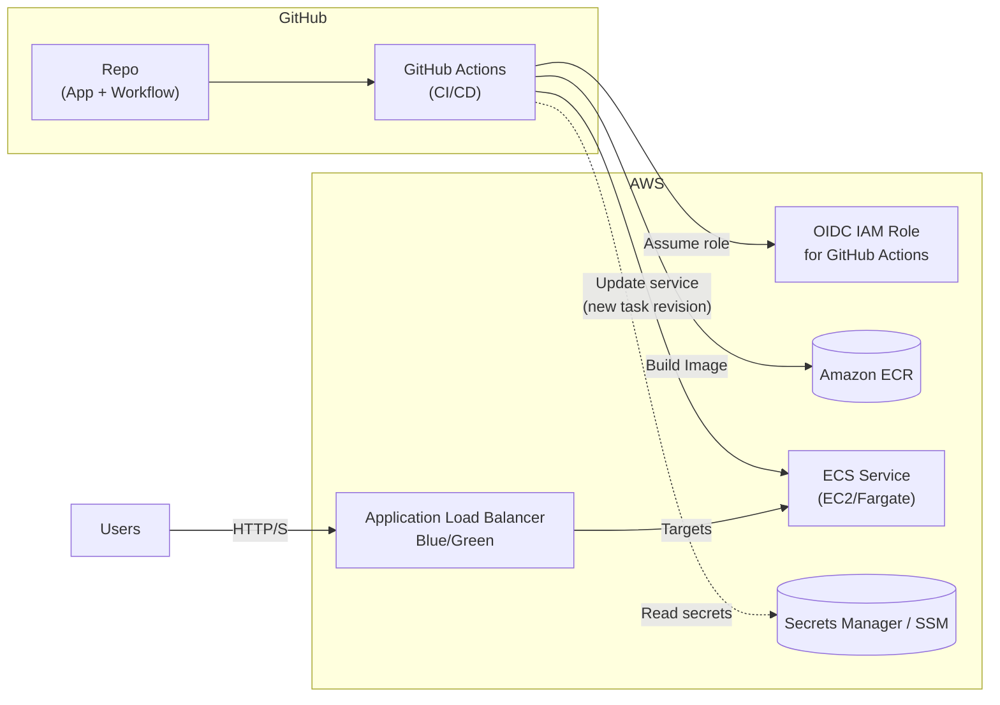

\n+---
\n+### Detailed ECS Infrastructure (Infra View)
\n+```mermaid
flowchart TB
  %% Entry / DNS / Cert
  U["Users / Browsers"] -->|"HTTPS (443)"| DNS[("Route53 Hosted Zone
  ecs.gitops.club")] 
  DNS -->|ALIAS| ALB["Application Load Balancer
  (Blue/Green Listeners + Target Groups)
  ACM TLS Cert"]

  subgraph Net["VPC"]
    subgraph Pub["Public Subnets"]
      ALB
    end
    subgraph Priv["Private Subnets"]
      TG1["Target Group Blue"]
      TG2["Target Group Green"]
      subgraph ECSCluster["ECS Cluster (EC2/Fargate)"]
        SVC["ECS Service (Desired Tasks)"]
        TASKS["Running Task Definitions
        (Containers)"]
      end
    end
  end

  ALB -->|Forward rule / Listener| TG1
  ALB -->|Forward rule / Listener| TG2
  TG1 --> SVC
  TG2 --> SVC
  SVC --> TASKS

  %% Observability
  CW[("CloudWatch Logs")] <-->|stdout/metrics| TASKS

  %% App Dependencies / Config
  PARAMS[("SSM Parameter Store /
  Secrets Manager")]
  PARAMS -->|Inject env / secrets| TASKS

  %% Image Supply Chain
  subgraph Build["CI/CD Pipeline"]
    R2["GitHub Repo"] --> GA["GitHub Actions Workflow"]
    GA -->|OIDC Assume Role| OIDC2["IAM Role (OIDC Trust)"]
    GA -->|Build & Push| ECR[("Amazon ECR Repository")]
    GA -->|Register Task Def| ECSAPI["ECS API"]
  end

  ECR -->|Pull Image| TASKS

  %% Autoscaling
  AS["Application Auto Scaling
  (Target Tracking / Sched)"] -->|Adjust Desired Tasks| SVC

  %% IAM Relationships (dashed)
  classDef iam stroke-dasharray:3 5,stroke:#555,fill:#fff;
  OIDC2 -.->|Assume| IAMDeployRole["IAM Deploy Role"]:::iam
  IAMDeployRole -.-> ECSAPI:::iam
  IAMDeployRole -.-> ECR:::iam
  TASKS -.->|Task Role| IAMTaskRole["IAM Task Role"]:::iam
  TASKS -.->|Execution Role| IAMExecRole["IAM Execution Role"]:::iam
  IAMExecRole -.-> PARAMS:::iam
  IAMExecRole -.-> ECR:::iam

```
