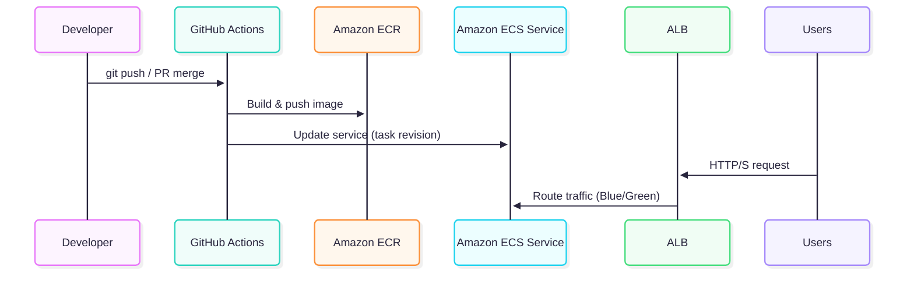

```mermaid
---
config:
  theme: redux-color
  look: neo
---
sequenceDiagram
  participant Dev as Developer
  participant GH as GitHub Actions
  participant ECR as Amazon ECR
  participant ECS as Amazon ECS Service
  participant ALB as ALB
  participant User as Users
  Dev->>GH: git push / PR merge
  GH->>ECR: Build & push image
  GH->>ECS: Update service (task revision)
  User->>ALB: HTTP/S request
  ALB->>ECS: Route traffic (Blue/Green)

```