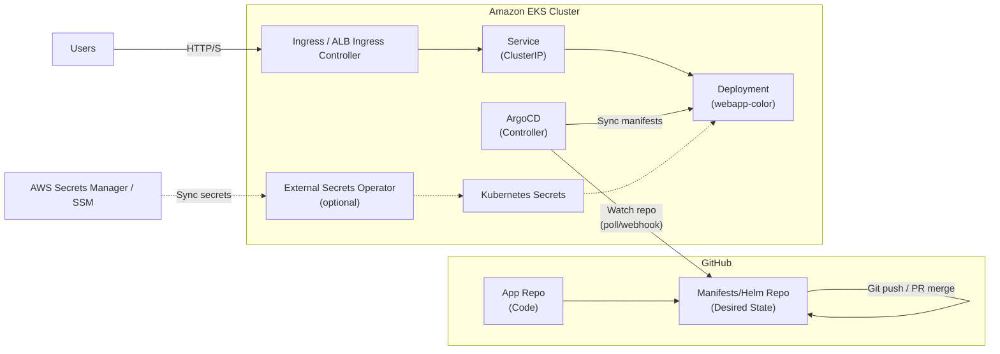

```mermaid
flowchart LR
  subgraph GitHub
    APP["App Repo
    (Code)"]
    INFRA["Manifests/Helm Repo
    (Desired State)"]
  end

  subgraph Kubernetes["Amazon EKS Cluster"]
    ARGO["ArgoCD
    (Controller)"]
    DEPLOY["Deployment
    (webapp-color)"]
    SVC["Service
    (ClusterIP)"]
    INGRESS["Ingress / ALB Ingress Controller"]
    ESO["External Secrets Operator
    (optional)"]
    K8SSECRETS["Kubernetes Secrets"]
  end

  AWS["AWS Secrets Manager / SSM"]

  USERS[Users] -->|"HTTP/S"| INGRESS
  INGRESS --> SVC
  SVC --> DEPLOY

  APP --> INFRA
  INFRA -->|"Git push / PR merge"| INFRA
  ARGO -->|"Sync manifests"| DEPLOY
  ARGO -->|"Watch repo
  (poll/webhook)"| INFRA

  AWS -.->|"Sync secrets"| ESO -.-> K8SSECRETS
  K8SSECRETS -.-> DEPLOY
```