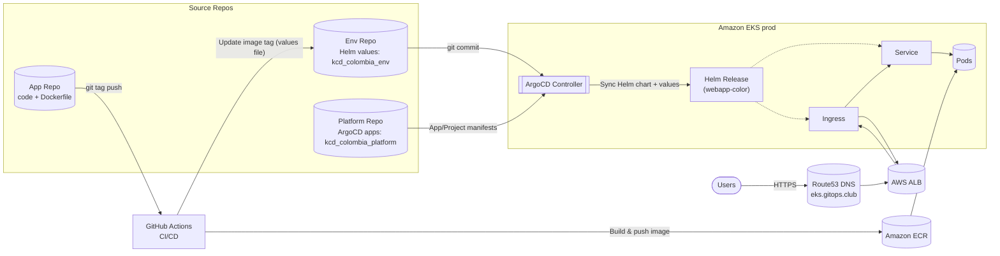

```mermaid
flowchart LR
  %% GitOps flow for webapp-color on EKS using Helm + ArgoCD, domain eks.gitops.club

  subgraph Repos[Source Repos]
    AppRepo[(App Repo<br/>code + Dockerfile)]
    EnvRepo[(Env Repo<br/>Helm values: kcd_colombia_env)]
    PlatformRepo[(Platform Repo<br/>ArgoCD apps: kcd_colombia_platform)]
  end

  AppRepo -->|git tag push| CI[GitHub Actions<br/>CI/CD]
  CI -->|Build & push image| ECR[(Amazon ECR)]
  CI -->|"Update image tag (values file)"| EnvRepo
  EnvRepo -->|git commit| ArgoCD
  PlatformRepo -->|App/Project manifests| ArgoCD

  subgraph Cluster[Amazon EKS prod]
    ArgoCD[[ArgoCD Controller]]
    Helm["Helm Release<br/>(webapp-color)"]
    Ingress[Ingress]
    Service[Service]
    Pods[(Pods)]
  end

  ArgoCD -->|Sync Helm chart + values| Helm
  Helm -.-> Ingress
  Helm -.-> Service
  Ingress --> Service
  Service --> Pods

  Ingress --> ALB[(AWS ALB)]
  DNS[(Route53 DNS<br/>eks.gitops.club)] --> ALB
  Users([Users]) -->|HTTPS| DNS
  ALB --> Ingress

  %% Images pulled by pods
  ECR --> Pods

  %% Legend (implicit):
  %% AppRepo: kcd_colombia_webapp_color
  %% EnvRepo: kcd_colombia_env (values update holds image tag)
  %% PlatformRepo: kcd_colombia_platform (ArgoCD app / project defs)
```