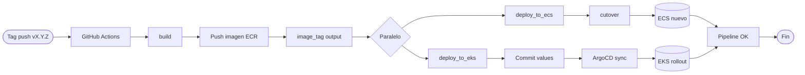

```mermaid
flowchart LR
    A([Tag push vX.Y.Z]) --> B[GitHub Actions]
    B --> C[build]
    C --> C2[Push imagen ECR]
    C2 --> C3[image_tag output]
    C3 --> D{Paralelo}

    D --> E[deploy_to_ecs]
    E --> F[cutover]
    F --> G[(ECS nuevo)]

    D --> H[deploy_to_eks]
    H --> I[Commit values]
    I --> J[ArgoCD sync]
    J --> L[(EKS rollout)]

    G --> Z[Pipeline OK]
    L --> Z --> W([Fin])
```