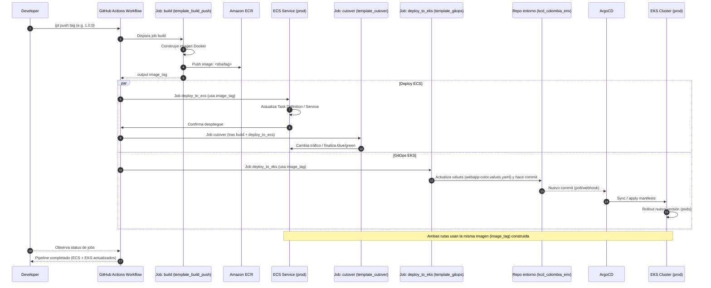

```mermaid
sequenceDiagram
    autonumber
    participant Dev as Developer
    participant GH as GitHub Actions Workflow
    participant B as Job: build (template_build_push)
    participant ECR as Amazon ECR
    participant ECS as ECS Service (prod)
    participant CUT as Job: cutover (template_cutover)
    participant GITOPS as Job: deploy_to_eks (template_gitops)
    participant ENV as Repo entorno (kcd_colombia_env)
    participant Argo as ArgoCD
    participant EKS as EKS Cluster (prod)

    Dev->>GH: git push tag (e.g. 1.0.0)
    GH->>B: Dispara job build
    B->>B: Construye imagen Docker
    B->>ECR: Push image: <sha/tag>
    B-->>GH: output image_tag

    par Deploy ECS
        GH->>ECS: Job deploy_to_ecs (usa image_tag)
        ECS->>ECS: Actualiza Task Definition / Service
        ECS->>GH: Confirma despliegue
        GH->>CUT: Job cutover (tras build + deploy_to_ecs)
        CUT->>ECS: Cambia tráfico / finaliza blue/green
    and GitOps EKS
        GH->>GITOPS: Job deploy_to_eks (usa image_tag)
        GITOPS->>ENV: Actualiza values (webapp-color.values.yaml) y hace commit
        ENV-->>Argo: Nuevo commit (poll/webhook)
        Argo->>EKS: Sync / apply manifests
        EKS->>EKS: Rollout nueva versión (pods)
    end

    note over ECS,EKS: Ambas rutas usan la misma imagen (image_tag) construida

    Dev-->>GH: Observa status de jobs
    GH-->>Dev: Pipeline completado (ECS + EKS actualizados)
```