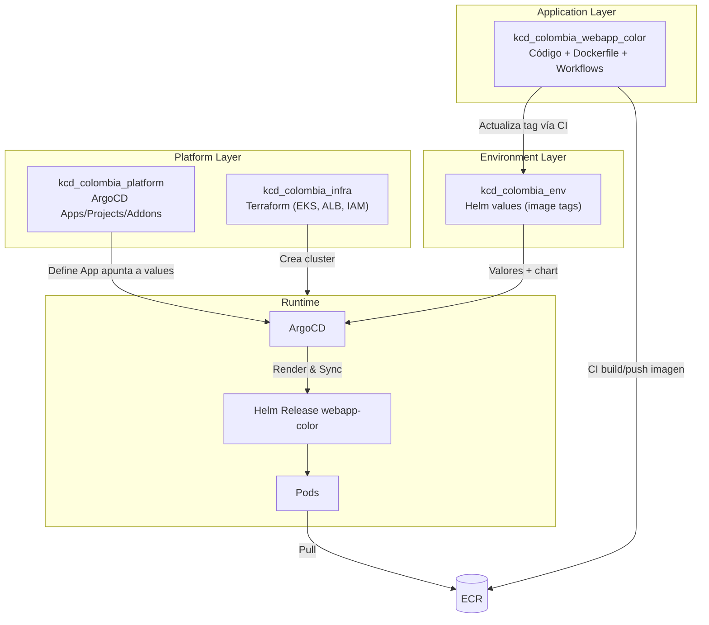

```mermaid
graph TD
    subgraph Application Layer
        AppRepo[kcd_colombia_webapp_color<br/>Código + Dockerfile + Workflows]
    end
    subgraph Environment Layer
        EnvRepo["kcd_colombia_env
        Helm values (image tags)"]
    end
    subgraph Platform Layer
        PlatformRepo[kcd_colombia_platform<br/>ArgoCD Apps/Projects/Addons]
        InfraRepo["kcd_colombia_infra
        Terraform (EKS, ALB, IAM)"]
    end
    subgraph Runtime
        Argo[ArgoCD]
        HelmRel[Helm Release webapp-color]
        Pods[Pods]
    end

    AppRepo -->|CI build/push imagen| ECR[(ECR)]
    AppRepo -->|Actualiza tag vía CI| EnvRepo
    PlatformRepo -->|Define App apunta a values| Argo
    EnvRepo -->|Valores + chart| Argo
    InfraRepo -->|Crea cluster| Runtime
    Argo -->|Render & Sync| HelmRel --> Pods
    Pods -->|Pull| ECR
```